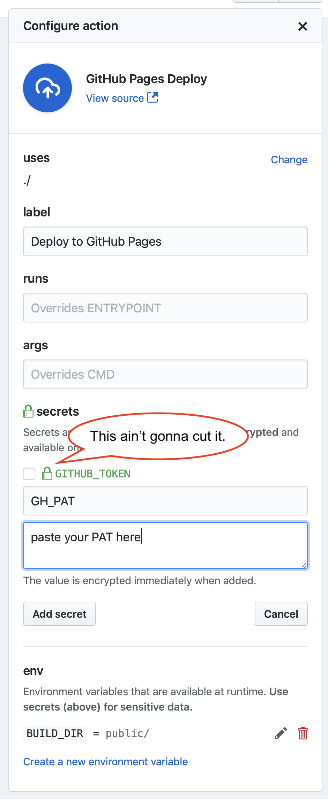
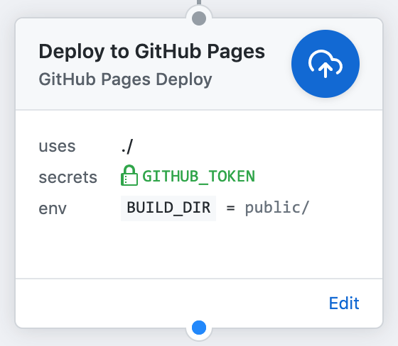

# Deploy arbitrary static assets to GitHub Actions

[](https://github.com/maxheld83/ghaction-ghpages/actions)

This action simply lets you deploy arbitrary folders of static content from your workflow's working directory (`/github/workspace`) to [GitHub pages](https://pages.github.com).
This works by having your action instance `git push` your chosen asset folder (`BUILD_DIR`) to the `gh-pages` branch of your GitHub repository for the `gh-pages` branch to be served.
Remember that you may also have to adjust your [repository settings](https://help.github.com/articles/configuring-a-publishing-source-for-github-pages/).

There are already great GitHub actions to use static site generators *and* then deploy to GitHub Pages (for [jekyll](https://github.com/helaili/jekyll-action), [jekyll](https://github.com/BryanSchuetz/jekyll-deploy-gh-pages), [zola](https://github.com/shalzz/zola-deploy-action) and surely many more to come).
This action isn't that, though I've borrowed much of the git action from these works.

**This action will not build anything, it just deploys.**


## Secrets



Deployment to GitHub pages happens by `git push`ing to the `gh-pages` branch.
To authorise this, the GitHub action needs a secret.
For now, somewhat confusingly, the `GITHUB_TOKEN` [available for every repo](https://developer.github.com/actions/creating-workflows/storing-secrets/) *does* suffice to push to `gh-pages`, but *does not* suffice to trigger a  page build on GitHub, or even propagate the content to the GitHub content-delivery network.

You therefore **have to [create a custom Personal Access Token (PAT)](https://help.github.com/articles/creating-a-personal-access-token-for-the-command-line/)** much like you'd do for external services (say, Travis).
You then have to paste this token into the GitHub UI as a secret under the name `GH_PAT` (repository settings/secrets) and call it in the action as in the below.

I've asked GitHub to streamline this process.
The discussion is documented [here](https://github.com/maxheld83/ghaction-ghpages/issues/1).


## Environment Variables

Just `BUILD_DIR`, the build directory relative to your repository root.
You can also pass `/.` if you want to push your repository root.


## Arguments

There are none.


## Example Usage



```
action "Deploy to GitHub Pages" {
  uses = "maxheld83/ghaction-ghpages@v0.1"
  env = {
    BUILD_DIR = "public/"
  }
  secrets = ["GH_PAT"]
}
```
